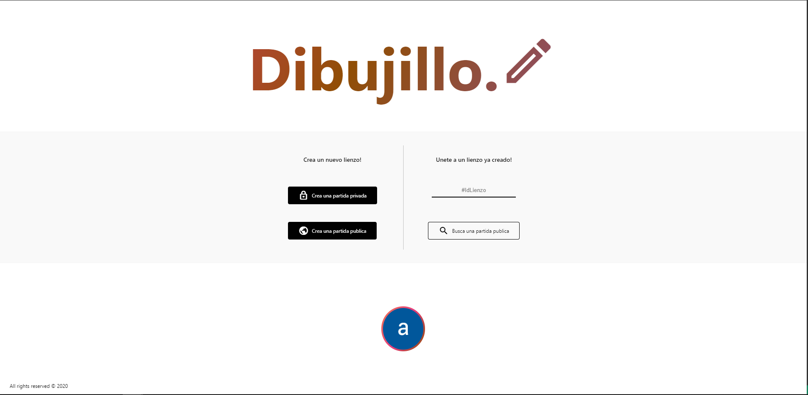

[![Build & Test][build-badge]][build-link]
[![Github license][license-image]][repo-link]
[![Version][version-image]][repo-version-link]
[![codecov][codevoc-badge]][codecov-link]

  

# Dibujillo

This project was created to offer some fun to our friends!

The game in wich is based is [pinturillo2][pinturillo-link].

In addition to the base game we will add some other new features and games [#features].

## Features

Features list:
- google account login
- friendly interface
- friends management
- chat room
- full game configurator
- public / private games
- limited / unlimited game rooms

## Contributors

- [Adrián Insua Yañez][ai-link]
- [Andrés Baamonde Lozano][ab-link]

## How to become contributor

[Contributing][contrib-link]

[build-badge]: https://github.com/AdrianInsua/dibujillo/workflows/Build%20&%20Test/badge.svg
[build-link]: https://github.com/AdrianInsua/dibujillo/actions?query=workflow%3A%22Build+%26+Test%22
[license-image]: https://badgen.net/github/license/AdrianInsua/dibujillo
[repo-link]: https://github.com/AdrianInsua/dibujillo
[version-image]: https://badgen.net/github/release/AdrianInsua/dibujillo/stable
[repo-version-link]: https://github.com/AdrianInsua/dibujillo/releases
[codecov-badge]: https://codecov.io/gh/AdrianInsua/dibujillo/branch/master/graph/badge.svg?token=VFBULDCLME
[codecov-link]: https://codecov.io/gh/AdrianInsua/dibujillo
[pinturillo-link]: https://www.pinturillo2.com/
[ai-link]: https://github.com/AdrianInsua
[ab-link]: https://github.com/mandrewcito
[contrib-link]: https://github.com/AdrianInsua/dibujillo/blob/master/.github/CONTRIBUTING.md
